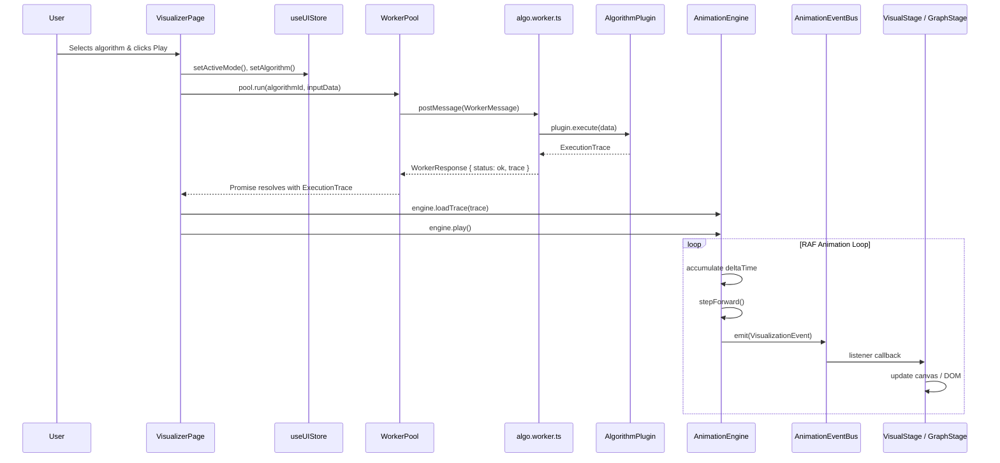
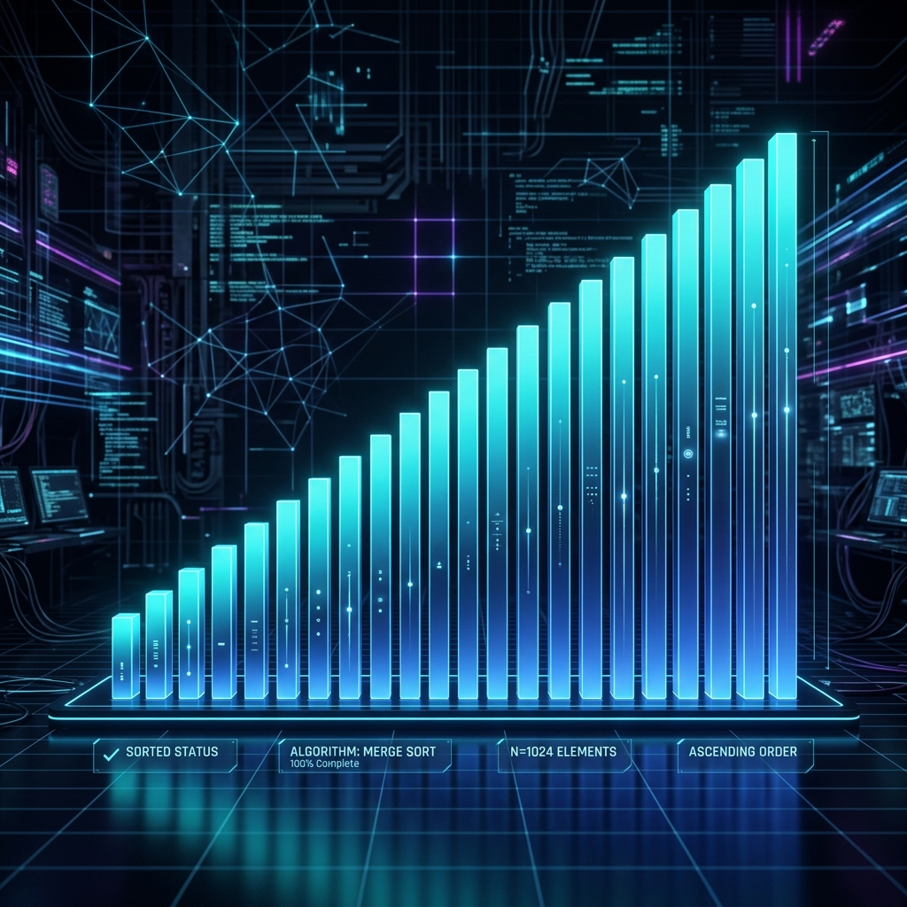
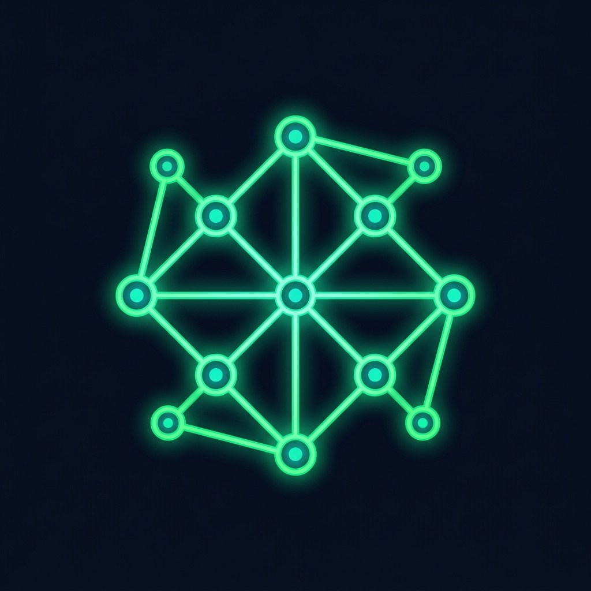
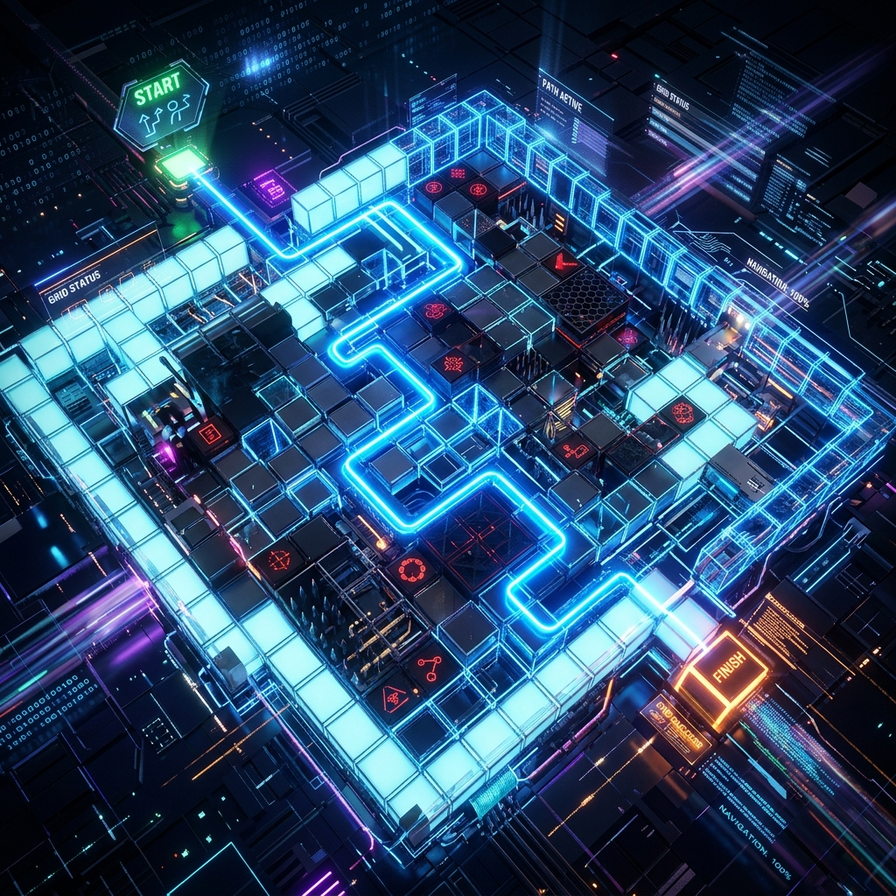
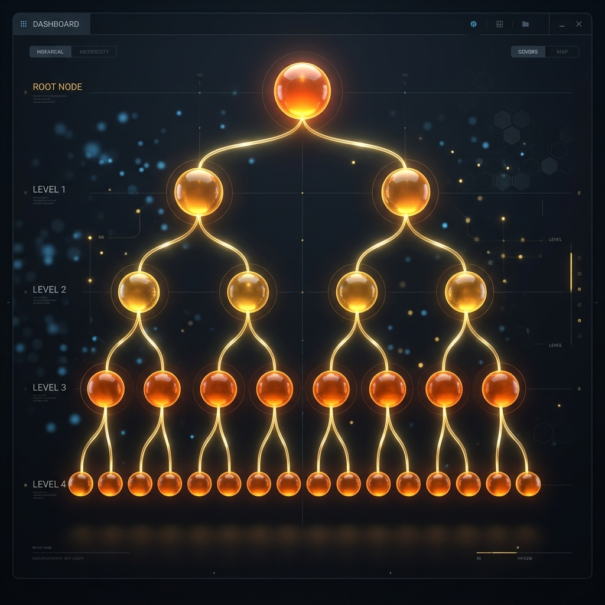
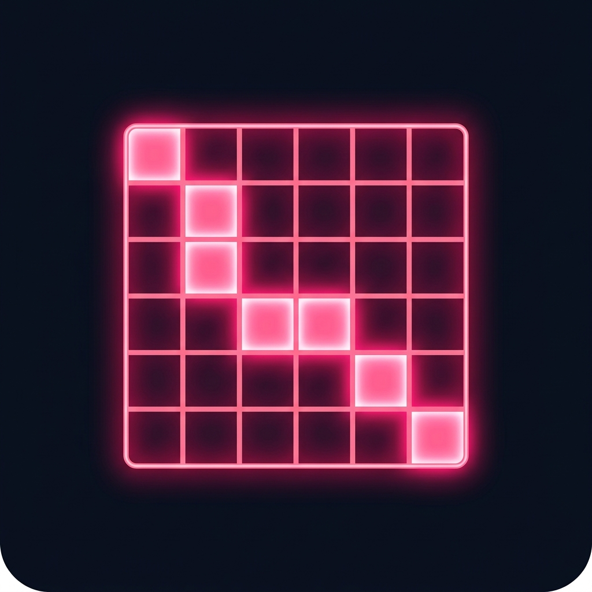

# 🌌 Algorithm Visualizer EDVR (Educational Digital Visualizer Engine)

[](https://react.dev/)
[](https://go.dev/)
[](https://www.docker.com/)
[](https://www.typescriptlang.org/)
[](https://www.postgresql.org/)
[](https://github.com/pmndrs/zustand)

A high-performance, full-stack algorithm execution engine that safely compiles, runs, and visualizes complex user-submitted code in real-time. Built with a premium, physics-driven canvas and encapsulated in a secure, sandboxed multi-container ecosystem.

## 📐 UML Architecture & System Design

Below is the complete architectural layout and UML documentation of the **Algorithm Visualizer EDVR** engine (originally introduced in commit `ef38451` by Jakub Rządzki), mapping the Frontend React-Zustand architecture, Go Backend, and the Secure Sandbox orchestration.

<details>
<summary>🔍 Click to expand the full UML Class Diagram (Mermaid)</summary>

```mermaid
classDiagram
    direction TB

    %% ═══════════════════════════════════════════════════════════════
    %% DOMAIN TYPES & INTERFACES
    %% ═══════════════════════════════════════════════════════════════

    class BaseEvent {
        <<type>>
        +id: string
        +timestamp: number
        +step: number
        +eventSource?: string
        +lineNumber?: number
        +isReverse?: boolean
    }

    class EventPayload {
        <<discriminated union>>
        +type: string
        +...payload fields
    }

    class VisualizationEvent {
        <<type alias>>
        BaseEvent & EventPayload
    }

    class TraceMetadata {
        <<type>>
        +timeComplexity: string
        +spaceComplexity: string
        +executionTimeMs: number
        +nodeCount: number
        +algorithmName: string
        +initialState?: any
    }

    class ExecutionTrace {
        <<type>>
        +events: VisualizationEvent[]
        +metadata: TraceMetadata
    }

    class AlgorithmPlugin~T~ {
        <<interface>>
        +id: string
        +name: string
        +category: sorting | graph | tree | dp
        +execute(data: T): ExecutionTrace
    }

    BaseEvent --> VisualizationEvent : composes
    EventPayload --> VisualizationEvent : composes
    VisualizationEvent --> ExecutionTrace : events[]
    TraceMetadata --> ExecutionTrace : metadata
    AlgorithmPlugin ..> ExecutionTrace : produces

    %% ═══════════════════════════════════════════════════════════════
    %% DATA INPUT MODELS
    %% ═══════════════════════════════════════════════════════════════

    class GraphNode {
        <<interface>>
        +id: string
        +label: string
        +x: number
        +y: number
        +vx: number
        +vy: number
    }

    class GraphEdge {
        <<interface>>
        +id: string
        +from: string
        +to: string
        +weight: number
    }

    class GraphInput {
        <<interface>>
        +nodes: GraphNode[]
        +edges: GraphEdge[]
        +startNodeId?: string
    }

    class ArrayInput {
        <<interface>>
        +values: number[]
    }

    class GridInput {
        <<interface>>
        +width: number
        +height: number
        +walls: Coord[]
    }

    class MatrixInput {
        <<interface>>
        +rows: number
        +cols: number
        +values: number[][]
    }

    class VisualizationData {
        <<union type>>
        GraphInput | ArrayInput | GridInput | MatrixInput
    }

    GraphNode --> GraphInput : nodes[]
    GraphEdge --> GraphInput : edges[]
    GraphInput --> VisualizationData
    ArrayInput --> VisualizationData
    GridInput --> VisualizationData
    MatrixInput --> VisualizationData

    %% ═══════════════════════════════════════════════════════════════
    %% CORE ENGINE LAYER
    %% ═══════════════════════════════════════════════════════════════

    class AnimationEventBus {
        -listeners: EventListener[]
        +emit(event: VisualizationEvent): void
        +subscribe(listener: EventListener): UnsubscribeFn
        +clearSubscribers(): void
    }

    class AnimationEngine {
        -currentTrace: ExecutionTrace | null
        -currentStep: number
        -isPlaying: boolean
        -playbackSpeed: number
        -rafId: number | null
        -lastFrameTime: number
        -accumulatedTime: number
        #baseTickMs: number = 500
        -activeAnimations: Map~string, ActiveAnimation~
        -animationIdCounter: number
        +generateTraceWithWatchdog~T~(plugin, input, timeout): Promise~ExecutionTrace~
        +loadTrace(trace: ExecutionTrace): void
        +play(): void
        +pause(): void
        +stepForward(): void
        +stepBackward(): void
        +seekTo(stepIndex: number): void
        +setSpeed(multiplier: number): void
        +scheduleAnimation(duration, onUpdate, easing, onComplete): string
        +cancelAnimation(id: string): void
        +getState(): PlaybackState
        -updateAnimations(): void
        -emitPlaybackState(): void
        -animationLoop(currentTime: number): void
    }

    class Easing {
        <<module>>
        +linear(t: number): number
        +easeOut(t: number): number
        +easeInOut(t: number): number
        +easeOutQuad(t: number): number
        +easeInQuad(t: number): number
    }

    class WorkerPool {
        -pool: PoolWorker[]
        -taskQueue: QueuedTask[]
        -pending: Map~string, PendingTask~
        #maxWorkers: number
        +run(algorithmId: string, payload: GraphInput): Promise~ExecutionTrace~
        +destroy(): void
        -spawnWorkers(): void
        -dispatch(pw, message, resolve, reject): void
        -handleWorkerMessage(pw, response): void
        -handleWorkerError(pw, error): void
        -drainQueue(pw): void
    }

    class WorkerMessage {
        <<interface>>
        +taskId: string
        +algorithmId: string
        +payload: GraphInput
    }

    class WorkerResponse {
        <<discriminated union>>
        +taskId: string
        +status: ok | error
        +trace?: ExecutionTrace
        +message?: string
    }

    AnimationEngine --> AnimationEventBus : emits via globalEventBus
    AnimationEngine --> ExecutionTrace : consumes
    AnimationEngine --> Easing : uses
    AnimationEngine --> AlgorithmPlugin : executes via watchdog
    WorkerPool --> WorkerMessage : sends to workers
    WorkerPool --> WorkerResponse : receives from workers
    WorkerPool --> ExecutionTrace : resolves promises with

    %% ═══════════════════════════════════════════════════════════════
    %% ZUSTAND STATE MANAGEMENT
    %% ═══════════════════════════════════════════════════════════════

    class useUIStore {
        <<Zustand Store>>
        +theme: glacier
        +animationSpeed: number
        +isSidebarOpen: boolean
        +isDebugVisible: boolean
        +activeCategory: string
        +activeSortingAlgorithm: string
        +activeGraphAlgorithm: string
        +activeMode: sorting | graph
        +isAnimating: boolean
        +visualizationData: VisualizationData | null
        +currentGraph: GraphInput | null
        +isLoading: boolean
        +shareLink: string
        +setAnimationSpeed(speed): void
        +toggleSidebar(): void
        +toggleDebug(): void
        +setActiveCategory(cat): void
        +setActiveSortingAlgorithm(algo): void
        +setActiveGraphAlgorithm(algo): void
        +setActiveMode(mode): void
        +setIsAnimating(v): void
        +setVisualizationData(data): void
        +setCurrentGraph(graph): void
        +setIsLoading(v): void
        +setShareLink(link): void
    }

    useUIStore --> VisualizationData : manages
    useUIStore --> GraphInput : legacy alias

    %% ═══════════════════════════════════════════════════════════════
    %% REACT COMPONENT TREE
    %% ═══════════════════════════════════════════════════════════════

    class App {
        <<React Component>>
        +render(): JSX
    }

    class Dashboard {
        <<React Component / Page>>
        +render(): JSX — algorithm catalog grid
    }

    class VisualizerPage {
        <<React Component / Page>>
        +render(): JSX — full workspace
    }

    class Navbar {
        <<React Component>>
    }

    class Sidebar {
        <<React Component>>
    }

    class VisualStage {
        <<React Component>>
        - sorting bar visualization
    }

    class GraphStage {
        <<React Component>>
        +nodes: GraphNode[]
        +edges: GraphEdge[]
    }

    class MonacoCodeEditor {
        <<React Component>>
        - Monaco Editor integration
        - GlacierDark custom theme
        - Language selector: TS / Python / C++
        - Format & Save to localStorage
    }

    class EventLog {
        <<React Component>>
    }

    class PlaybackDeck {
        <<React Component>>
    }

    class AmbientGraph {
        <<React Component>>
        - background floating mesh
    }

    App --> Navbar : renders
    App --> Dashboard : route /
    App --> VisualizerPage : route /algo/:category/:id
    VisualizerPage --> Sidebar : renders if open
    VisualizerPage --> VisualStage : sorting mode
    VisualizerPage --> GraphStage : graph mode
    VisualizerPage --> MonacoCodeEditor : aside panel
    VisualizerPage --> EventLog : aside panel
    VisualizerPage --> PlaybackDeck : bottom bar
    VisualizerPage --> AmbientGraph : background

    VisualizerPage --> useUIStore : reads / writes
    MonacoCodeEditor --> useUIStore : reads activeMode & algorithm
    PlaybackDeck --> AnimationEngine : play/pause/seek
    VisualStage --> AnimationEventBus : subscribes
    GraphStage --> AnimationEventBus : subscribes

    %% ═══════════════════════════════════════════════════════════════
    %% ALGORITHM CATALOG (Data Layer)
    %% ═══════════════════════════════════════════════════════════════

    class AlgorithmCatalog {
        <<Data Module>>
        +ALGORITHM_CATALOG: CategoryEntry[]
        +findAlgorithm(categoryId, algoId): Match | null
        +getAllAlgorithms(): FlatList
    }

    class CategoryEntry {
        <<interface>>
        +id: string
        +label: string
        +iconImage: string
        +color: string
        +borderColor: string
        +glowColor: string
        +algorithms: AlgorithmEntry[]
    }

    class AlgorithmEntry {
        <<interface>>
        +id: string
        +name: string
        +shortName: string
        +description: string
        +timeComplexity: string
        +spaceComplexity: string
        +available: boolean
    }

    AlgorithmEntry --> CategoryEntry : algorithms[]
    CategoryEntry --> AlgorithmCatalog : ALGORITHM_CATALOG[]
    Dashboard --> AlgorithmCatalog : reads
    VisualizerPage --> AlgorithmCatalog : findAlgorithm()

    %% ═══════════════════════════════════════════════════════════════
    %% CONCRETE ALGORITHM PLUGINS
    %% ═══════════════════════════════════════════════════════════════

    class MergeSortPlugin {
        +id: merge-sort
        +name: Merge Sort
        +category: sorting
        +execute(data: ArrayInput): ExecutionTrace
    }

    class QuickSortPlugin {
        +id: quick-sort
        +name: Quick Sort
        +category: sorting
        +execute(data: ArrayInput): ExecutionTrace
    }

    class DijkstraPlugin {
        +id: dijkstra
        +name: Dijkstra
        +category: graph
        +execute(data: GraphInput): ExecutionTrace
    }

    class KruskalPlugin {
        +id: kruskal
        +name: Kruskal
        +category: graph
        +execute(data: GraphInput): ExecutionTrace
    }

    AlgorithmPlugin <|.. MergeSortPlugin : implements
    AlgorithmPlugin <|.. QuickSortPlugin : implements
    AlgorithmPlugin <|.. DijkstraPlugin : implements
    AlgorithmPlugin <|.. KruskalPlugin : implements

    %% ═══════════════════════════════════════════════════════════════
    %% GO BACKEND
    %% ═══════════════════════════════════════════════════════════════

    class GoBackend {
        <<Go / Gin Server>>
        -db: *gorm.DB
        +POST /api/snapshots → SaveSnapshot()
        +GET /api/snapshots/:id → GetSnapshot()
        +POST /api/run → RunCodeInSandbox()
        -initDB(): void
    }

    class Snapshot {
        <<GORM Model>>
        +ID: string [PK, varchar 10]
        +Data: datatypes.JSON
        +CreatedAt: time.Time
    }

    class RunRequest {
        <<Go Struct>>
        +Code: string
        +Language: python | cpp
    }

    class RunResponse {
        <<Go Struct>>
        +Trace: []map
        +Error: string
        +Output: string
    }

    GoBackend --> Snapshot : CRUD via GORM
    GoBackend --> RunRequest : binds from POST body
    GoBackend --> RunResponse : returns JSON

    %% ═══════════════════════════════════════════════════════════════
    %% DOCKER / INFRA
    %% ═══════════════════════════════════════════════════════════════

    class DockerCompose {
        <<Infrastructure>>
        +frontend: Nginx container (port 80)
        +api: Go container (port 8080)
        +db: PostgreSQL 15 (port 5432)
    }

    class SandboxContainer {
        <<Ephemeral Docker Container>>
        +image: python:3.10-slim | gcc:13
        +networkDisabled: true
        +memoryLimit: 256 MB
        +cpuLimit: 0.5 CPU
        +timeout: 2s
    }

    DockerCompose --> GoBackend : hosts api service
    GoBackend --> SandboxContainer : spawns ephemeral containers for RCE
    DockerCompose --> Snapshot : db service hosts PostgreSQL
```

---

</details>

## Relationship Summary

| From | To | Relationship | Description |
|------|----|-------------|-------------|
| `App.tsx` | `WorkerPool` | uses (singleton) | Offloads algorithm execution to Web Workers |
| `WorkerPool` | `AlgorithmPlugin` | executes | Workers import plugin modules and call `.execute()` |
| `AnimationEngine` | `ExecutionTrace` | consumes | Loads trace and replays events via RAF loop |
| `AnimationEngine` | `AnimationEventBus` | emits | Publishes `VisualizationEvent` to all subscribers |
| `VisualStage` / `GraphStage` | `AnimationEventBus` | subscribes | Listens for events and updates canvas/DOM |
| `MonacoCodeEditor` | `useUIStore` | reads | Determines which algorithm source to display |
| `GoBackend` | `SandboxContainer` | spawns | Creates Docker containers for remote code execution |
| `GoBackend` | `Snapshot` | persists | Saves/loads visualization snapshots via PostgreSQL |

---

## Event Flow (Sequence)



---

## File Mapping

| UML Class | File Path |
|-----------|-----------|
| `AlgorithmPlugin<T>` | `src/types.ts` |
| `ExecutionTrace` | `src/types.ts` |
| `VisualizationEvent` | `src/types.ts` |
| `GraphInput`, `ArrayInput`, etc. | `src/types.ts` |
| `AnimationEngine` | `src/core/AnimationEngine.ts` |
| `AnimationEventBus` | `src/core/EventBus.ts` |
| `WorkerPool` | `src/core/WorkerPool.ts` |
| `useUIStore` | `src/store/uiStore.ts` |
| `AlgorithmCatalog` | `src/data/algorithmCatalog.ts` |
| `MonacoCodeEditor` | `src/components/hud/MonacoCodeEditor.tsx` |
| `GoBackend` | `backend/main.go` |
| `DockerCompose` | `docker-compose.yml` |


---

## 🧭 1. Overview & Philosophy

**EDVR (Educational Digital Visualizer Engine)** is not just a UI toy or a hardcoded frontend-only visualization helper. It is a robust, production-grade **full-stack execution engine** designed to safely compile and run real C++ and Python algorithms on arbitrary user inputs, capture their exact execution logs, and replay them with mathematical precision. 

The core philosophy of EDVR centers on two main pillars:
1. **Absolute Security**: Safely executing untrusted user code at scale without risking the host machine.
2. **Visual Fluidity**: Render-cycle-free, physics-based canvas animations that keep pace with high-frequency execution traces (60FPS+) under a bespoke **"Glacier Glassmorphism" UI** design system.

### 🖼️ Visual Showcase & Engine Capabilities

EDVR includes dedicated real-time visual workspaces tailored to different computational domains. Below is the preview of the live interface layers:

| Sorting Algorithms (`sorting.png`) | Graph Algorithms (`graphs.png`) |
| :---: | :---: |
|  |  |
| **Sorting Stage**: Real-time comparison pointer, swap micro-animations, and bar resizing. | **Graph Stage**: Physics-driven Force-Directed layout, shortest-path node highlight, and weight markers. |

| Grid & Pathfinding (`grid.png`) | Binary Tree Structures (`trees.png`) |
| :---: | :---: |
|  |  |
| **Grid Workspace**: Dynamic obstacle wall painting, heuristic weights, path highlights. | **Tree Visualizer**: Smooth node rotations (AVL/BST), parent-child connection springs. |

| Dynamic Programming (`dp.png`) | Linear Searches (`searching.png`) |
| :---: | :---: |
|  |  |
| **DP Matrix HUD**: Interactive memoization tables, backtracking paths, and cell evaluations. | **Searching Stage**: Dynamic index scanning, key comparison highlights, and step intervals. |

---

## 🛠️ 2. Technical Stack & "The Why"

Every technology in the EDVR stack was selected after careful architectural analysis, choosing performance and isolation over convenience.

```
┌────────────────────────────────────────────────────────────────────────┐
│                        GLACIER GLASSMORPHISM UI                        │
│               React 19  │  Zustand  │  Framer Motion (SVG)              │
└───────────────────────────────────┬────────────────────────────────────┘
                                    │ Web Workers (WorkerPool)
                                    ▼
┌────────────────────────────────────────────────────────────────────────┐
│                        HIGH-PERFORMANCE API                            │
│                         Go 1.21  │  Gin Router                         │
└───────────────────────────────────┬────────────────────────────────────┘
                                    │ Docker Daemon API (gRPC / Unix Socket)
                                    ▼
┌────────────────────────────────────────────────────────────────────────┐
│                        SECURE EXECUTION SANDBOX                        │
│             Ephemeral Docker Containers (gcc:13 / python:3.10)          │
│                Memory caps: 256MB  │  Net Disabled  │  10s Watchdog     │
└────────────────────────────────────────────────────────────────────────┘
```

| Technology | Selected Over | Strategic Justification |
| :--- | :--- | :--- |
| **Backend: Go / Gin** | Node.js / Express | Exceptional concurrency, extremely low memory footprint, and native OS-level integration when communicating with the Docker daemon via UNIX sockets. |
| **Sandboxing: Docker** | VM-based hypervisors | Docker provides the exact balance of instant containment startup latency (<50ms) and comprehensive resources limitation (cgroups/namespaces) required for real-time compilation. |
| **Frontend: React + Zustand** | Redux / Recoil | React yields solid component hierarchy, while **Zustand** provides a lightweight, polymorphic global state slice without boilerplate, avoiding complex context re-renders. |
| **Animations: Framer Motion + SVGs** | D3.js / Cytoscape.js | D3.js relies heavily on custom DOM bindings. We needed **physics-based spring animations** that bypass React's standard state-update render cycle entirely to sustain 60FPS fluid layouts under stress. |

---

## ⚡ 3. Engineering Challenges Solved

### 🏎️ Challenge A: The React Re-render Trap (High-Frequency Visualization)
* **The Problem**: Visualizing complex algorithms (such as Quick Sort or Dijkstra's shortest path) triggers hundreds of trace events per second (updates to array pointers, pivot highlights, node state transitions). Standard React state bindings (`useState` / context) force full-tree re-renders, causing browser layout-thrashing and dropping frame rates to single digits.
* **The Solution**: Designed and built a custom **`AnimationEventBus`** (a lightweight Pub-Sub broker) that bypasses the React render phase completely. 
  1. The UI components register mutable React `useRef` handles pointing to native SVG DOM nodes.
  2. The `AnimationEngine` emits state changes directly into the event bus using a RequestAnimationFrame (RAF) loop.
  3. Subscribers listen to the bus and call imperative **Framer Motion `useAnimation`** controls directly on the mutable refs. This separates the animation pipeline from React's state reconciliation completely.

### 🛡️ Challenge B: Remote Code Execution (RCE) and Untrusted Code Sandbox
* **The Problem**: Executing raw C++ and Python code submitted by users opens the system up to fork bombs, host filesystem exploitation, memory exhaustion, and outbound spam/DDoS vectors.
* **The Solution**: Implemented a highly secure **Docker Sandbox** at the API broker layer:
  * **Network Isolation**: Containers are constructed with `NetworkDisabled: true` to prevent any outbound or local socket access.
  * **Memory Guard**: Memory is strictly hard-capped at **256MB** using Linux cgroups (`container.Resources{Memory: 256 * 1024 * 1024}`).
  * **CPU Limits**: Shares are throttled to a maximum of **0.5 CPU cores** (`NanoCPUs: 500000000`).
  * **Infinite Loop Watchdog**: A Go-routine-backed watchdog monitors execution and forces a container kill-command (`cli.ContainerRemove` with Force) if execution exceeds a **10-second threshold**, returning a strict `408 Request Timeout` response.

### 🧵 Challenge C: UI Main Thread Blockages
* **The Problem**: Parsing large execution traces (tens of thousands of JSON lines) and performing physics-based graph layout calculations (Force-Directed Graph layouts) block the browser's single-threaded event loop, freezing animations.
* **The Solution**: Architected the **Object Pool Pattern** implemented via a multi-threaded **`WorkerPool`** utilizing HTML5 Web Workers:
  * All heavy computation—including trace-parsing, parsing of complex layout coordinates, and mathematical step-interpolation—is delegated off-thread to `algo.worker.ts`.
  * The main thread only receives computed state snapshots, preserving a buttery-smooth 60FPS UI transition rate.

---

## 📐 4. Architecture & Design Patterns

### 📡 The Trace Protocol
Communication between the backend sandbox and the visual interface is driven by a standardized streaming **Trace Protocol**. During code execution, the program writes structured JSON statements to its standard output. The engine intercepts these logs and converts them into a standardized `ExecutionTrace` structure:

```json
{
  "type": "ELEMENT_SWAP",
  "step": 42,
  "lineNumber": 15,
  "payload": {
    "indexA": 3,
    "indexB": 7,
    "currentValues": [12, 19, 24, 45, 99]
  }
}
```

### 🧩 The Strategy Pattern
To prevent bloating the visualizer frontend when adding new algorithms, EDVR employs the **Strategy Design Pattern** via a strict TypeScript interface `AlgorithmPlugin<T>`.

```typescript
export interface AlgorithmPlugin<T> {
  id: string;
  name: string;
  category: "sorting" | "graph" | "tree" | "dp";
  execute(data: T): ExecutionTrace;
}
```
Any new algorithm (e.g. Red-Black Trees, A* Search) is written as an isolated plugin, registering itself with the `AlgorithmCatalog` without modifying the core state machines or rendering stages.

## 🚀 5. Getting Started & Local Development

### Prerequisites
* **Docker** & **Docker Compose** installed.
* **Go 1.21+** and **Node.js 18+** (only if running services bare-metal outside of containers).

### Standard Containerized Setup (Recommended)
This launches the complete multi-service stack:
1. **Frontend**: Vite SPA bundled and served via Nginx on port `80`.
2. **Backend**: Go API brokering compilation requests on port `8080`.
3. **Database**: PostgreSQL 15 listening on port `5432` for snapshots.

Run the following command at the project root:

```bash
# Build all images and spin up the complete environment in detached mode
docker-compose up -d --build
```

#### Port Allocations & Verification

Once Docker has successfully compiled and initialized the containers, verify that the services are online:

| Service | Port | Endpoint / Health Check |
| :--- | :--- | :--- |
| **Glacier Frontend** | `http://localhost:80` | Client visual panel / main entry point |
| **Go Gin Router** | `http://localhost:8080` | `GET http://localhost:8080/api/snapshots/:id` |
| **PostgreSQL Database** | `http://localhost:5432` | Accessible via any standard SQL client |

---

## 🎨 6. The "Glacier Glassmorphism" Design Language

To create a premium UI experience, the system operates on a customized CSS glassmorphism implementation:
* **Backgrounds**: High-blur backdrop-filters (`backdrop-filter: blur(20px)`) combined with dynamic, translucent color overlays (HSL tailored palettes).
* **Borders**: Thin, semi-transparent gradients that mimic refracting ice.
* **Micro-Animations**: Smooth, elastic spring physics using Framer Motion (no linear, artificial-feeling easing curves).
* **Typography**: Outfit & Inter fonts (fetched dynamically via Google Fonts API) to ensure high readability and slick layout styling.

---
*EDVR Engine is created for developers who value security, speed, and beautiful visual feedback.*
