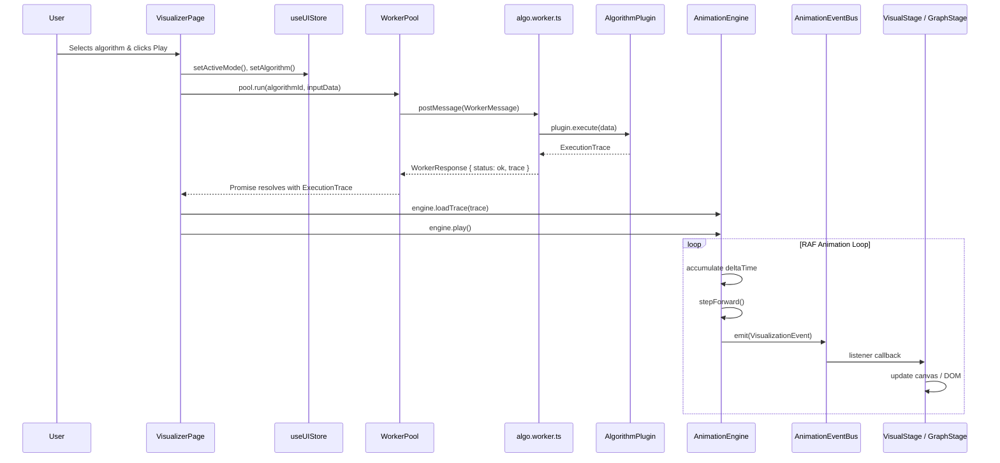

# Algorithm Visualizer EDVR

[](https://react.dev/)
[](https://go.dev/)
[](https://www.docker.com/)
[](https://www.typescriptlang.org/)
[](https://www.postgresql.org/)
[](https://github.com/pmndrs/zustand)

A full-stack algorithm execution engine that compiles, runs, and visualizes user-submitted code in real-time. Built with a physics-driven canvas UI and encapsulated in a secure, sandboxed multi-container Docker ecosystem.

---

## Table of Contents

1. [Overview](#overview)
2. [Tech Stack](#tech-stack)
3. [Supported Algorithms](#supported-algorithms)
4. [Architecture](#architecture)
5. [Getting Started](#getting-started)
6. [Engineering Details](#engineering-details)
7. [Design Patterns](#design-patterns)
8. [Project Structure](#project-structure)

---

## Overview

EDVR (Educational Digital Visualizer Engine) is a production-grade system for safely executing untrusted C++ and Python code, capturing structured execution traces, and replaying them with frame-accurate animations at 60 FPS.

The project has two operating modes:
- **Offline mode** -- algorithms run client-side via Web Worker plugins (no backend required).
- **Online mode** -- user code is compiled and executed inside ephemeral Docker containers with full network isolation, memory caps, and CPU limits.

Key properties:
- Sandbox isolation via Docker containers with `NetworkDisabled: true`, 256 MB memory cap, 0.5 CPU limit, 10s watchdog.
- Custom `AnimationEventBus` bypasses React re-renders entirely -- SVG nodes are updated imperatively via `useRef` + Framer Motion controls.
- Web Worker pool offloads trace parsing and force-directed graph layout off the main thread.
- Bilingual interface (Polish / English) with a full interactive tutorial system.

---

## Tech Stack

```
+------------------------------------------------------------------------+
|                         FRONTEND (SPA)                                 |
|          React 19  |  Zustand  |  Framer Motion  |  Vite  |  TailwindCSS  |
+------------------------------------+-----------------------------------+
                                     | Web Workers (WorkerPool)
                                     v
+------------------------------------------------------------------------+
|                         BACKEND API                                    |
|                      Go 1.21  |  Gin  |  GORM                         |
+------------------------------------+-----------------------------------+
                                     | Docker Daemon API
                                     v
+------------------------------------------------------------------------+
|                    SECURE EXECUTION SANDBOX                             |
|          Ephemeral Docker Containers (gcc:13 / python:3.10-slim)       |
|         Memory: 256 MB  |  Network: disabled  |  Timeout: 10s         |
+------------------------------------------------------------------------+
                                     |
                                     v
+------------------------------------------------------------------------+
|                         DATABASE                                       |
|                    PostgreSQL 15 (snapshots)                            |
+------------------------------------------------------------------------+
```

| Layer | Technology | Reason |
| :--- | :--- | :--- |
| Frontend | React 19 + Zustand | Lightweight global state without context re-render overhead |
| Animations | Framer Motion + SVG | Physics-based spring animations that bypass React reconciliation |
| Backend | Go / Gin | Low memory footprint, native goroutine concurrency, direct Docker daemon integration |
| Sandbox | Docker containers | Sub-50ms startup, cgroups/namespaces isolation, instant teardown |
| Database | PostgreSQL 15 | Snapshot persistence via GORM with in-memory fallback |

---

## Supported Algorithms

### Sorting
- Bubble Sort
- Merge Sort
- Quick Sort
- Heap Sort

### Graph
- BFS (Breadth-First Search)
- DFS (Depth-First Search)
- Dijkstra's Shortest Path
- Kruskal's MST
- Prim's MST
- Topological Sort

### Trees
- Binary Tree traversal
- Binary Search Tree (BST)
- AVL Tree (with rotations)
- Red-Black Tree
- Max Heap
- Trie
- Union-Find (Disjoint Set)

### Grid / Pathfinding
- A* Search
- Flood Fill

### Dynamic Programming
- 0/1 Knapsack
- Longest Common Subsequence (LCS)

### Searching
- Linear Search
- Binary Search

Each algorithm has implementations in three forms:
- **TypeScript plugin** (`src/core/plugins/`) -- runs client-side in Web Workers.
- **Python source** (`src/algorithms/python/`) -- runs in Docker sandbox.
- **C++ source** (`src/algorithms/cpp/`) -- runs in Docker sandbox.

---

## Architecture

Full UML documentation originally authored in commit `ef38451`.

<details>
<summary>Click to expand the full UML Class Diagram (Mermaid)</summary>

```mermaid
classDiagram
    direction TB

    %% =================================================================
    %% DOMAIN TYPES & INTERFACES
    %% =================================================================

    class BaseEvent {
        <<type>>
        +id: string
        +timestamp: number
        +step: number
        +eventSource?: string
        +lineNumber?: number
        +isReverse?: boolean
    }

    class EventPayload {
        <<discriminated union>>
        +type: string
        +...payload fields
    }

    class VisualizationEvent {
        <<type alias>>
        BaseEvent & EventPayload
    }

    class TraceMetadata {
        <<type>>
        +timeComplexity: string
        +spaceComplexity: string
        +executionTimeMs: number
        +nodeCount: number
        +algorithmName: string
        +initialState?: any
    }

    class ExecutionTrace {
        <<type>>
        +events: VisualizationEvent[]
        +metadata: TraceMetadata
    }

    class AlgorithmPlugin~T~ {
        <<interface>>
        +id: string
        +name: string
        +category: sorting | graph | tree | dp
        +execute(data: T): ExecutionTrace
    }

    BaseEvent --> VisualizationEvent : composes
    EventPayload --> VisualizationEvent : composes
    VisualizationEvent --> ExecutionTrace : events[]
    TraceMetadata --> ExecutionTrace : metadata
    AlgorithmPlugin ..> ExecutionTrace : produces

    %% =================================================================
    %% DATA INPUT MODELS
    %% =================================================================

    class GraphNode {
        <<interface>>
        +id: string
        +label: string
        +x: number
        +y: number
        +vx: number
        +vy: number
    }

    class GraphEdge {
        <<interface>>
        +id: string
        +from: string
        +to: string
        +weight: number
    }

    class GraphInput {
        <<interface>>
        +nodes: GraphNode[]
        +edges: GraphEdge[]
        +startNodeId?: string
    }

    class ArrayInput {
        <<interface>>
        +values: number[]
    }

    class GridInput {
        <<interface>>
        +width: number
        +height: number
        +walls: Coord[]
    }

    class MatrixInput {
        <<interface>>
        +rows: number
        +cols: number
        +values: number[][]
    }

    class VisualizationData {
        <<union type>>
        GraphInput | ArrayInput | GridInput | MatrixInput
    }

    GraphNode --> GraphInput : nodes[]
    GraphEdge --> GraphInput : edges[]
    GraphInput --> VisualizationData
    ArrayInput --> VisualizationData
    GridInput --> VisualizationData
    MatrixInput --> VisualizationData

    %% =================================================================
    %% CORE ENGINE LAYER
    %% =================================================================

    class AnimationEventBus {
        -listeners: EventListener[]
        +emit(event: VisualizationEvent): void
        +subscribe(listener: EventListener): UnsubscribeFn
        +clearSubscribers(): void
    }

    class AnimationEngine {
        -currentTrace: ExecutionTrace | null
        -currentStep: number
        -isPlaying: boolean
        -playbackSpeed: number
        -rafId: number | null
        -lastFrameTime: number
        -accumulatedTime: number
        #baseTickMs: number = 500
        -activeAnimations: Map~string, ActiveAnimation~
        -animationIdCounter: number
        +generateTraceWithWatchdog~T~(plugin, input, timeout): Promise~ExecutionTrace~
        +loadTrace(trace: ExecutionTrace): void
        +play(): void
        +pause(): void
        +stepForward(): void
        +stepBackward(): void
        +seekTo(stepIndex: number): void
        +setSpeed(multiplier: number): void
        +scheduleAnimation(duration, onUpdate, easing, onComplete): string
        +cancelAnimation(id: string): void
        +getState(): PlaybackState
        -updateAnimations(): void
        -emitPlaybackState(): void
        -animationLoop(currentTime: number): void
    }

    class Easing {
        <<module>>
        +linear(t: number): number
        +easeOut(t: number): number
        +easeInOut(t: number): number
        +easeOutQuad(t: number): number
        +easeInQuad(t: number): number
    }

    class WorkerPool {
        -pool: PoolWorker[]
        -taskQueue: QueuedTask[]
        -pending: Map~string, PendingTask~
        #maxWorkers: number
        +run(algorithmId: string, payload: GraphInput): Promise~ExecutionTrace~
        +destroy(): void
        -spawnWorkers(): void
        -dispatch(pw, message, resolve, reject): void
        -handleWorkerMessage(pw, response): void
        -handleWorkerError(pw, error): void
        -drainQueue(pw): void
    }

    class WorkerMessage {
        <<interface>>
        +taskId: string
        +algorithmId: string
        +payload: GraphInput
    }

    class WorkerResponse {
        <<discriminated union>>
        +taskId: string
        +status: ok | error
        +trace?: ExecutionTrace
        +message?: string
    }

    AnimationEngine --> AnimationEventBus : emits via globalEventBus
    AnimationEngine --> ExecutionTrace : consumes
    AnimationEngine --> Easing : uses
    AnimationEngine --> AlgorithmPlugin : executes via watchdog
    WorkerPool --> WorkerMessage : sends to workers
    WorkerPool --> WorkerResponse : receives from workers
    WorkerPool --> ExecutionTrace : resolves promises with

    %% =================================================================
    %% ZUSTAND STATE MANAGEMENT
    %% =================================================================

    class useUIStore {
        <<Zustand Store>>
        +theme: glacier
        +animationSpeed: number
        +isSidebarOpen: boolean
        +isDebugVisible: boolean
        +activeCategory: string
        +activeSortingAlgorithm: string
        +activeGraphAlgorithm: string
        +activeMode: sorting | graph
        +isAnimating: boolean
        +visualizationData: VisualizationData | null
        +currentGraph: GraphInput | null
        +isLoading: boolean
        +shareLink: string
        +setAnimationSpeed(speed): void
        +toggleSidebar(): void
        +toggleDebug(): void
        +setActiveCategory(cat): void
        +setActiveSortingAlgorithm(algo): void
        +setActiveGraphAlgorithm(algo): void
        +setActiveMode(mode): void
        +setIsAnimating(v): void
        +setVisualizationData(data): void
        +setCurrentGraph(graph): void
        +setIsLoading(v): void
        +setShareLink(link): void
    }

    useUIStore --> VisualizationData : manages
    useUIStore --> GraphInput : legacy alias

    %% =================================================================
    %% REACT COMPONENT TREE
    %% =================================================================

    class App {
        <<React Component>>
        +render(): JSX
    }

    class Dashboard {
        <<React Component / Page>>
        +render(): JSX — algorithm catalog grid
    }

    class VisualizerPage {
        <<React Component / Page>>
        +render(): JSX — full workspace
    }

    class Navbar {
        <<React Component>>
    }

    class Sidebar {
        <<React Component>>
    }

    class VisualStage {
        <<React Component>>
        - sorting bar visualization
    }

    class GraphStage {
        <<React Component>>
        +nodes: GraphNode[]
        +edges: GraphEdge[]
    }

    class MonacoCodeEditor {
        <<React Component>>
        - Monaco Editor integration
        - GlacierDark custom theme
        - Language selector: TS / Python / C++
        - Format & Save to localStorage
    }

    class EventLog {
        <<React Component>>
    }

    class PlaybackDeck {
        <<React Component>>
    }

    class AmbientGraph {
        <<React Component>>
        - background floating mesh
    }

    App --> Navbar : renders
    App --> Dashboard : route /
    App --> VisualizerPage : route /algo/:category/:id
    VisualizerPage --> Sidebar : renders if open
    VisualizerPage --> VisualStage : sorting mode
    VisualizerPage --> GraphStage : graph mode
    VisualizerPage --> MonacoCodeEditor : aside panel
    VisualizerPage --> EventLog : aside panel
    VisualizerPage --> PlaybackDeck : bottom bar
    VisualizerPage --> AmbientGraph : background

    VisualizerPage --> useUIStore : reads / writes
    MonacoCodeEditor --> useUIStore : reads activeMode & algorithm
    PlaybackDeck --> AnimationEngine : play/pause/seek
    VisualStage --> AnimationEventBus : subscribes
    GraphStage --> AnimationEventBus : subscribes

    %% =================================================================
    %% ALGORITHM CATALOG (Data Layer)
    %% =================================================================

    class AlgorithmCatalog {
        <<Data Module>>
        +ALGORITHM_CATALOG: CategoryEntry[]
        +findAlgorithm(categoryId, algoId): Match | null
        +getAllAlgorithms(): FlatList
    }

    class CategoryEntry {
        <<interface>>
        +id: string
        +label: string
        +iconImage: string
        +color: string
        +borderColor: string
        +glowColor: string
        +algorithms: AlgorithmEntry[]
    }

    class AlgorithmEntry {
        <<interface>>
        +id: string
        +name: string
        +shortName: string
        +description: string
        +timeComplexity: string
        +spaceComplexity: string
        +available: boolean
    }

    AlgorithmEntry --> CategoryEntry : algorithms[]
    CategoryEntry --> AlgorithmCatalog : ALGORITHM_CATALOG[]
    Dashboard --> AlgorithmCatalog : reads
    VisualizerPage --> AlgorithmCatalog : findAlgorithm()

    %% =================================================================
    %% CONCRETE ALGORITHM PLUGINS
    %% =================================================================

    class MergeSortPlugin {
        +id: merge-sort
        +name: Merge Sort
        +category: sorting
        +execute(data: ArrayInput): ExecutionTrace
    }

    class QuickSortPlugin {
        +id: quick-sort
        +name: Quick Sort
        +category: sorting
        +execute(data: ArrayInput): ExecutionTrace
    }

    class DijkstraPlugin {
        +id: dijkstra
        +name: Dijkstra
        +category: graph
        +execute(data: GraphInput): ExecutionTrace
    }

    class KruskalPlugin {
        +id: kruskal
        +name: Kruskal
        +category: graph
        +execute(data: GraphInput): ExecutionTrace
    }

    AlgorithmPlugin <|.. MergeSortPlugin : implements
    AlgorithmPlugin <|.. QuickSortPlugin : implements
    AlgorithmPlugin <|.. DijkstraPlugin : implements
    AlgorithmPlugin <|.. KruskalPlugin : implements

    %% =================================================================
    %% GO BACKEND
    %% =================================================================

    class GoBackend {
        <<Go / Gin Server>>
        -db: *gorm.DB
        +POST /api/snapshots → SaveSnapshot()
        +GET /api/snapshots/:id → GetSnapshot()
        +POST /api/run → RunCodeInSandbox()
        -initDB(): void
    }

    class Snapshot {
        <<GORM Model>>
        +ID: string [PK, varchar 10]
        +Data: datatypes.JSON
        +CreatedAt: time.Time
    }

    class RunRequest {
        <<Go Struct>>
        +Code: string
        +Language: python | cpp
    }

    class RunResponse {
        <<Go Struct>>
        +Trace: []map
        +Error: string
        +Output: string
    }

    GoBackend --> Snapshot : CRUD via GORM
    GoBackend --> RunRequest : binds from POST body
    GoBackend --> RunResponse : returns JSON

    %% =================================================================
    %% DOCKER / INFRA
    %% =================================================================

    class DockerCompose {
        <<Infrastructure>>
        +frontend: Nginx container (port 80)
        +api: Go container (port 8080)
        +db: PostgreSQL 15 (port 5432)
    }

    class SandboxContainer {
        <<Ephemeral Docker Container>>
        +image: python:3.10-slim | gcc:13
        +networkDisabled: true
        +memoryLimit: 256 MB
        +cpuLimit: 0.5 CPU
        +timeout: 2s
    }

    DockerCompose --> GoBackend : hosts api service
    GoBackend --> SandboxContainer : spawns ephemeral containers for RCE
    DockerCompose --> Snapshot : db service hosts PostgreSQL
```

</details>

### Relationship Summary

| From | To | Relationship | Description |
|------|----|-------------|-------------|
| `App.tsx` | `WorkerPool` | uses (singleton) | Offloads algorithm execution to Web Workers |
| `WorkerPool` | `AlgorithmPlugin` | executes | Workers import plugin modules and call `.execute()` |
| `AnimationEngine` | `ExecutionTrace` | consumes | Loads trace and replays events via RAF loop |
| `AnimationEngine` | `AnimationEventBus` | emits | Publishes `VisualizationEvent` to all subscribers |
| `VisualStage` / `GraphStage` | `AnimationEventBus` | subscribes | Listens for events and updates canvas/DOM |
| `MonacoCodeEditor` | `useUIStore` | reads | Determines which algorithm source to display |
| `GoBackend` | `SandboxContainer` | spawns | Creates Docker containers for remote code execution |
| `GoBackend` | `Snapshot` | persists | Saves/loads visualization snapshots via PostgreSQL |

### Event Flow



### File Mapping

| UML Class | File Path |
|-----------|-----------|
| `AlgorithmPlugin<T>` | `src/types.ts` |
| `ExecutionTrace` | `src/types.ts` |
| `VisualizationEvent` | `src/types.ts` |
| `GraphInput`, `ArrayInput`, etc. | `src/types.ts` |
| `AnimationEngine` | `src/core/AnimationEngine.ts` |
| `AnimationEventBus` | `src/core/EventBus.ts` |
| `WorkerPool` | `src/core/WorkerPool.ts` |
| `useUIStore` | `src/store/uiStore.ts` |
| `AlgorithmCatalog` | `src/data/algorithmCatalog.ts` |
| `MonacoCodeEditor` | `src/components/hud/MonacoCodeEditor.tsx` |
| `GoBackend` | `backend/main.go` |
| `DockerCompose` | `docker-compose.yml` |

---

## Getting Started

### Prerequisites

| Tool | Required for | Minimum version |
| :--- | :--- | :--- |
| Node.js | Frontend development | 18+ |
| npm | Package management | 9+ |
| Docker + Docker Compose | Full-stack deployment / sandbox execution | Docker 24+, Compose v2 |
| Go | Backend development (bare-metal only) | 1.21+ |

### Option A: Frontend only (no Docker)

This is the fastest way to start. The frontend runs standalone -- algorithms execute client-side in Web Workers. Code execution via Docker sandbox will not be available, but all visualizations work.

```bash
# 1. Clone the repository
git clone https://github.com/JakubRzadzki/visual_algo.git
cd visual_algo

# 2. Install dependencies
npm install --legacy-peer-deps

# 3. Start the development server
npm run dev
```

The app will be available at `http://localhost:5173`.

### Option B: Full stack with Docker Compose (recommended)

This launches the complete multi-service stack: frontend (Nginx), Go API, and PostgreSQL.

```bash
# 1. Clone the repository
git clone https://github.com/JakubRzadzki/visual_algo.git
cd visual_algo

# 2. Build and start all services
docker-compose up -d --build
```

Once the containers are running:

| Service | URL | Description |
| :--- | :--- | :--- |
| Frontend | `http://localhost:80` | Main application |
| Go API | `http://localhost:8080` | Code execution + snapshot API |
| PostgreSQL | `localhost:5432` | Snapshot storage (user: `user`, password: `password`, db: `visual_algo`) |

To stop everything:

```bash
docker-compose down
```

To stop and also remove the database volume:

```bash
docker-compose down -v
```

### Option C: Backend bare-metal (without Docker Compose)

If you want to run the Go backend outside of Docker (for development), you still need Docker running on the host for the sandbox containers.

```bash
# Terminal 1 -- start the frontend
npm install --legacy-peer-deps
npm run dev

# Terminal 2 -- start the Go backend
cd backend
go mod tidy
go run main.go
```

The backend listens on port `8080`. The Vite dev server proxies `/api` requests to it automatically (configured in `vite.config.ts`).

### Running Tests

```bash
# Frontend unit tests (Vitest)
npm run test

# Backend tests
cd backend
go test ./...
```

### Building for Production

```bash
npm run build
```

Output goes to `dist/`. The Dockerfile uses this output with an Nginx container for production serving.

---

## Engineering Details

### Problem: React re-render trap at high event frequency

Visualizing algorithms like Quick Sort or Dijkstra produces hundreds of trace events per second. Standard React state bindings (`useState`, context) force full-tree re-renders, dropping frame rates to single digits.

**Solution**: A custom `AnimationEventBus` (pub-sub broker) bypasses React's render phase entirely:
1. UI components register mutable `useRef` handles pointing to native SVG DOM nodes.
2. The `AnimationEngine` emits state changes into the event bus via a `requestAnimationFrame` loop.
3. Subscribers call imperative Framer Motion `useAnimation` controls directly on the mutable refs -- no React reconciliation involved.

### Problem: Remote Code Execution security

Executing raw user-submitted C++ and Python opens the system to fork bombs, filesystem exploitation, memory exhaustion, and network abuse.

**Solution**: Ephemeral Docker containers with:
- `NetworkDisabled: true` -- no outbound or local socket access.
- Memory hard-capped at 256 MB via Linux cgroups.
- CPU throttled to 0.5 cores (`NanoCPUs: 500000000`).
- Go-routine watchdog kills the container after 10 seconds, returning `408 Request Timeout`.
- Containers are force-removed after execution regardless of outcome.

When Docker is unavailable, the backend falls back to direct host execution (development convenience only).

### Problem: Main thread blocking

Parsing large execution traces and computing force-directed graph layouts blocks the browser event loop.

**Solution**: A `WorkerPool` using HTML5 Web Workers handles all heavy computation off-thread. The main thread receives only computed state snapshots, preserving 60 FPS.

---

## Design Patterns

### Trace Protocol

Communication between backend and frontend follows a structured JSON trace protocol. During execution, the program writes JSON lines to stdout. The backend collects them into an `ExecutionTrace`:

```json
{
  "type": "ELEMENT_SWAP",
  "step": 42,
  "lineNumber": 15,
  "payload": {
    "indexA": 3,
    "indexB": 7,
    "currentValues": [12, 19, 24, 45, 99]
  }
}
```

### Strategy Pattern

New algorithms are added as isolated plugins implementing the `AlgorithmPlugin<T>` interface:

```typescript
export interface AlgorithmPlugin<T> {
  id: string;
  name: string;
  category: "sorting" | "graph" | "tree" | "dp";
  execute(data: T): ExecutionTrace;
}
```

Plugins register themselves with the `AlgorithmCatalog` without modifying core state machines or rendering stages.

---

## Project Structure

```
visual_algo/
├── backend/
│   ├── Dockerfile          # Go API container
│   ├── main.go             # Gin server, snapshot CRUD, Docker sandbox RCE
│   └── main_test.go
├── public/
│   └── images/categories/  # Dashboard category icons
├── src/
│   ├── algorithms/
│   │   ├── cpp/            # C++ algorithm sources (sandbox execution)
│   │   ├── python/         # Python algorithm sources (sandbox execution)
│   │   └── source/         # TypeScript reference sources (editor display)
│   ├── components/
│   │   ├── background/     # AmbientGraph animated background
│   │   ├── controls/       # Playback controls
│   │   ├── dashboard/      # Algorithm catalog grid
│   │   ├── hud/            # MonacoCodeEditor, EventLog, stats panels
│   │   ├── layout/         # Navbar, Sidebar
│   │   ├── presentation/   # Presentation/demo mode overlay
│   │   ├── tutorial/       # Interactive tutorial system
│   │   └── visualizer/     # Graph stage (Cytoscape), grid, DP matrix, tree renderers
│   ├── core/
│   │   ├── AnimationEngine.ts
│   │   ├── EventBus.ts
│   │   ├── WorkerPool.ts
│   │   ├── plugins/        # All algorithm plugin implementations (TS)
│   │   └── workers/        # Web Worker entry points
│   ├── data/               # Algorithm catalog, educational content, i18n
│   ├── hooks/              # Custom React hooks
│   ├── pages/              # VisualizerPage, ShareLoader
│   ├── sorting/            # Standalone sorting visualizer module
│   ├── store/              # Zustand stores (uiStore, tutorialStore)
│   ├── types/              # TypeScript type definitions
│   ├── types.ts            # Core domain types
│   └── App.tsx             # Root component with routing
├── docker-compose.yml      # Multi-service orchestration
├── Dockerfile              # Frontend build (Vite -> Nginx)
├── nginx.conf              # SPA routing config
├── vite.config.ts
└── package.json
```

---

*EDVR -- Jakub Rzadzki*
