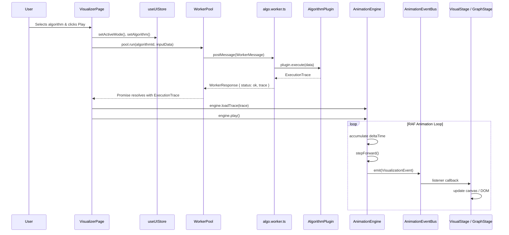

# Algorithm Visualizer — UML Architecture Documentation

> **System**: Algorithm Visualizer EDVR  
> **Stack**: React 19 + Zustand + Vite (Frontend) · Go + Gin + GORM (Backend) · PostgreSQL + Docker (Infra)  
> **Date**: 2026-04-25  

---

## Class Diagram (Mermaid)

```mermaid
classDiagram
    direction TB

    %% ── Core Types ──────────────────────────────────────────────────

    class BaseEvent {
        <<type>>
        +id: string
        +timestamp: number
        +step: number
        +eventSource: string
        +lineNumber: number
        +isReverse: boolean
    }

    class EventPayload {
        <<union>>
        +type: string
    }

    class VisualizationEvent {
        <<alias>>
    }

    class TraceMetadata {
        <<type>>
        +timeComplexity: string
        +spaceComplexity: string
        +executionTimeMs: number
        +nodeCount: number
        +algorithmName: string
        +initialState: any
    }

    class ExecutionTrace {
        <<type>>
        +events: list
        +metadata: TraceMetadata
    }

    %% ── Plugin Interface ────────────────────────────────────────────

    class AlgorithmPlugin {
        <<interface>>
        +id: string
        +name: string
        +category: string
        +execute(data: any): ExecutionTrace
    }

    %% ── Input / Data Types ──────────────────────────────────────────

    class GraphNode {
        <<interface>>
        +id: string
        +label: string
        +x: number
        +y: number
        +vx: number
        +vy: number
    }

    class GraphEdge {
        <<interface>>
        +id: string
        +from: string
        +to: string
        +weight: number
    }

    class GraphInput {
        <<interface>>
        +nodes: list
        +edges: list
        +startNodeId: string
    }

    class ArrayInput {
        <<interface>>
        +values: list
    }

    class GridInput {
        <<interface>>
        +width: number
        +height: number
        +walls: list
    }

    class MatrixInput {
        <<interface>>
        +rows: number
        +cols: number
        +values: list
    }

    class VisualizationData {
        <<union>>
    }

    %% ── Animation Core ──────────────────────────────────────────────

    class AnimationEventBus {
        -listeners: list
        +emit(event: VisualizationEvent): void
        +subscribe(listener: any): Function
        +clearSubscribers(): void
    }

    class AnimationEngine {
        -currentTrace: ExecutionTrace
        -currentStep: number
        -isPlaying: boolean
        -playbackSpeed: number
        -rafId: number
        -lastFrameTime: number
        -accumulatedTime: number
        #baseTickMs: number
        -activeAnimations: Map
        -animationIdCounter: number
        +generateTraceWithWatchdog(plugin: any, input: any, timeout: number): Promise
        +loadTrace(trace: ExecutionTrace): void
        +play(): void
        +pause(): void
        +stepForward(): void
        +stepBackward(): void
        +seekTo(stepIndex: number): void
        +setSpeed(multiplier: number): void
        +scheduleAnimation(duration: number, onUpdate: any, easing: any, onComplete: any): string
        +cancelAnimation(id: string): void
        +getState(): PlaybackState
        -updateAnimations(): void
        -emitPlaybackState(): void
        -animationLoop(currentTime: number): void
    }

    class Easing {
        <<module>>
        +linear(t: number): number
        +easeOut(t: number): number
        +easeInOut(t: number): number
        +easeOutQuad(t: number): number
        +easeInQuad(t: number): number
    }

    %% ── Worker Pool ─────────────────────────────────────────────────

    class WorkerPool {
        -pool: list
        -taskQueue: list
        -pending: Map
        #maxWorkers: number
        +run(algorithmId: string, payload: GraphInput): Promise
        +destroy(): void
        -spawnWorkers(): void
        -dispatch(pw: any, message: any, resolve: any, reject: any): void
        -handleWorkerMessage(pw: any, response: any): void
        -handleWorkerError(pw: any, error: any): void
        -drainQueue(pw: any): void
    }

    class WorkerMessage {
        <<interface>>
        +taskId: string
        +algorithmId: string
        +payload: GraphInput
    }

    class WorkerResponse {
        <<union>>
        +taskId: string
        +status: string
        +trace: ExecutionTrace
        +message: string
    }

    %% ── State Management ────────────────────────────────────────────

    class useUIStore {
        <<store>>
        +theme: string
        +animationSpeed: number
        +isSidebarOpen: boolean
        +isDebugVisible: boolean
        +activeCategory: string
        +activeSortingAlgorithm: string
        +activeGraphAlgorithm: string
        +activeMode: string
        +isAnimating: boolean
        +visualizationData: VisualizationData
        +currentGraph: GraphInput
        +isLoading: boolean
        +shareLink: string
        +setAnimationSpeed(speed: number): void
        +toggleSidebar(): void
        +toggleDebug(): void
        +setActiveCategory(cat: string): void
        +setActiveSortingAlgorithm(algo: string): void
        +setActiveGraphAlgorithm(algo: string): void
        +setActiveMode(mode: string): void
        +setIsAnimating(v: boolean): void
        +setVisualizationData(data: VisualizationData): void
        +setCurrentGraph(graph: GraphInput): void
        +setIsLoading(v: boolean): void
        +setShareLink(link: string): void
    }

    %% ── UI Components ───────────────────────────────────────────────

    class App {
        <<component>>
        +render(): JSX
    }

    class Dashboard {
        <<component>>
        +render(): JSX
    }

    class VisualizerPage {
        <<component>>
        +render(): JSX
    }

    class Navbar {
        <<component>>
    }

    class Sidebar {
        <<component>>
    }

    class VisualStage {
        <<component>>
    }

    class GraphStage {
        <<component>>
        +nodes: list
        +edges: list
    }

    class MonacoCodeEditor {
        <<component>>
    }

    class EventLog {
        <<component>>
    }

    class PlaybackDeck {
        <<component>>
    }

    class AmbientGraph {
        <<component>>
    }

    %% ── Algorithm Catalog ───────────────────────────────────────────

    class AlgorithmCatalog {
        <<module>>
        +ALGORITHM_CATALOG: list
        +findAlgorithm(categoryId: string, algoId: string): any
        +getAllAlgorithms(): list
    }

    class CategoryEntry {
        <<interface>>
        +id: string
        +label: string
        +iconImage: string
        +color: string
        +borderColor: string
        +glowColor: string
        +algorithms: list
    }

    class AlgorithmEntry {
        <<interface>>
        +id: string
        +name: string
        +shortName: string
        +description: string
        +timeComplexity: string
        +spaceComplexity: string
        +available: boolean
    }

    %% ── Plugin Implementations ──────────────────────────────────────

    class MergeSortPlugin {
        +id: string
        +name: string
        +category: string
        +execute(data: ArrayInput): ExecutionTrace
    }

    class QuickSortPlugin {
        +id: string
        +name: string
        +category: string
        +execute(data: ArrayInput): ExecutionTrace
    }

    class DijkstraPlugin {
        +id: string
        +name: string
        +category: string
        +execute(data: GraphInput): ExecutionTrace
    }

    class KruskalPlugin {
        +id: string
        +name: string
        +category: string
        +execute(data: GraphInput): ExecutionTrace
    }

    %% ── Backend ─────────────────────────────────────────────────────

    class GoBackend {
        <<server>>
        -db: DB
        +SaveSnapshot(): void
        +GetSnapshot(): void
        +RunCodeInSandbox(): void
    }

    class Snapshot {
        <<model>>
        +ID: string
        +Data: string
        +CreatedAt: Time
    }

    class RunRequest {
        <<struct>>
        +Code: string
        +Language: string
    }

    class RunResponse {
        <<struct>>
        +Trace: list
        +Error: string
        +Output: string
    }

    %% ── Infrastructure ──────────────────────────────────────────────

    class DockerCompose {
        <<infrastructure>>
        +frontend: string
        +api: string
        +db: string
    }

    class SandboxContainer {
        <<container>>
        +image: string
        +networkDisabled: boolean
        +memoryLimit: string
        +cpuLimit: string
        +timeout: string
    }

    %% ── Relationships ───────────────────────────────────────────────

    BaseEvent --> VisualizationEvent : composes
    EventPayload --> VisualizationEvent : composes
    VisualizationEvent --> ExecutionTrace : events
    TraceMetadata --> ExecutionTrace : metadata
    AlgorithmPlugin ..> ExecutionTrace : produces

    GraphNode --> GraphInput : nodes
    GraphEdge --> GraphInput : edges
    GraphInput --> VisualizationData
    ArrayInput --> VisualizationData
    GridInput --> VisualizationData
    MatrixInput --> VisualizationData

    AnimationEngine --> AnimationEventBus : emits via globalEventBus
    AnimationEngine --> ExecutionTrace : consumes
    AnimationEngine --> Easing : uses
    AnimationEngine --> AlgorithmPlugin : executes via watchdog
    WorkerPool --> WorkerMessage : sends to workers
    WorkerPool --> WorkerResponse : receives from workers
    WorkerPool --> ExecutionTrace : resolves promises with

    useUIStore --> VisualizationData : manages
    useUIStore --> GraphInput : legacy alias

    App --> Navbar : renders
    App --> Dashboard : route
    App --> VisualizerPage : route
    VisualizerPage --> Sidebar : renders if open
    VisualizerPage --> VisualStage : sorting mode
    VisualizerPage --> GraphStage : graph mode
    VisualizerPage --> MonacoCodeEditor : aside panel
    VisualizerPage --> EventLog : aside panel
    VisualizerPage --> PlaybackDeck : bottom bar
    VisualizerPage --> AmbientGraph : background

    VisualizerPage --> useUIStore : reads and writes
    MonacoCodeEditor --> useUIStore : reads activeMode and algorithm
    PlaybackDeck --> AnimationEngine : play/pause/seek
    VisualStage --> AnimationEventBus : subscribes
    GraphStage --> AnimationEventBus : subscribes

    AlgorithmEntry --> CategoryEntry : algorithms
    CategoryEntry --> AlgorithmCatalog : ALGORITHM_CATALOG
    Dashboard --> AlgorithmCatalog : reads
    VisualizerPage --> AlgorithmCatalog : findAlgorithm

    AlgorithmPlugin <|.. MergeSortPlugin : implements
    AlgorithmPlugin <|.. QuickSortPlugin : implements
    AlgorithmPlugin <|.. DijkstraPlugin : implements
    AlgorithmPlugin <|.. KruskalPlugin : implements

    GoBackend --> Snapshot : CRUD via GORM
    GoBackend --> RunRequest : binds from body
    GoBackend --> RunResponse : returns JSON

    DockerCompose --> GoBackend : hosts api
    GoBackend --> SandboxContainer : spawns
    DockerCompose --> Snapshot : hosts db
```

---

## Relationship Summary

| From | To | Relationship | Description |
|------|----|-------------|-------------|
| `App.tsx` | `WorkerPool` | uses (singleton) | Offloads algorithm execution to Web Workers |
| `WorkerPool` | `AlgorithmPlugin` | executes | Workers import plugin modules and call `.execute()` |
| `AnimationEngine` | `ExecutionTrace` | consumes | Loads trace and replays events via RAF loop |
| `AnimationEngine` | `AnimationEventBus` | emits | Publishes `VisualizationEvent` to all subscribers |
| `VisualStage` / `GraphStage` | `AnimationEventBus` | subscribes | Listens for events and updates canvas/DOM |
| `MonacoCodeEditor` | `useUIStore` | reads | Determines which algorithm source to display |
| `GoBackend` | `SandboxContainer` | spawns | Creates Docker containers for remote code execution |
| `GoBackend` | `Snapshot` | persists | Saves/loads visualization snapshots via PostgreSQL |

---

## Event Flow (Sequence)

---

## File Mapping

| UML Class | File Path |
|-----------|-----------|
| `AlgorithmPlugin<T>` | `src/types.ts` |
| `ExecutionTrace` | `src/types.ts` |
| `VisualizationEvent` | `src/types.ts` |
| `GraphInput`, `ArrayInput`, etc. | `src/types.ts` |
| `AnimationEngine` | `src/core/AnimationEngine.ts` |
| `AnimationEventBus` | `src/core/EventBus.ts` |
| `WorkerPool` | `src/core/WorkerPool.ts` |
| `useUIStore` | `src/store/uiStore.ts` |
| `AlgorithmCatalog` | `src/data/algorithmCatalog.ts` |
| `MonacoCodeEditor` | `src/components/hud/MonacoCodeEditor.tsx` |
| `GoBackend` | `backend/main.go` |
| `DockerCompose` | `docker-compose.yml` |
