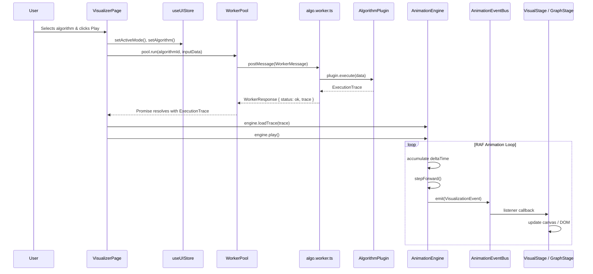

# Algorithm Visualizer — UML Architecture Documentation

> **System**: Algorithm Visualizer EDVR  
> **Stack**: React 19 + Zustand + Vite (Frontend) · Go + Gin + GORM (Backend) · PostgreSQL + Docker (Infra)  
> **Date**: 2026-04-25  

---

## Class Diagram (Mermaid)

```mermaid
classDiagram
    direction TB

    %% ═══════════════════════════════════════════════════════════════
    %% DOMAIN TYPES & INTERFACES
    %% ═══════════════════════════════════════════════════════════════

    class BaseEvent {
        <<type>>
        +id: string
        +timestamp: number
        +step: number
        +eventSource?: string
        +lineNumber?: number
        +isReverse?: boolean
    }

    class EventPayload {
        <<discriminated union>>
        +type: string
        +...payload fields
    }

    class VisualizationEvent {
        <<type alias>>
        BaseEvent & EventPayload
    }

    class TraceMetadata {
        <<type>>
        +timeComplexity: string
        +spaceComplexity: string
        +executionTimeMs: number
        +nodeCount: number
        +algorithmName: string
        +initialState?: any
    }

    class ExecutionTrace {
        <<type>>
        +events: VisualizationEvent[]
        +metadata: TraceMetadata
    }

    class AlgorithmPlugin~T~ {
        <<interface>>
        +id: string
        +name: string
        +category: sorting | graph | tree | dp
        +execute(data: T): ExecutionTrace
    }

    BaseEvent --> VisualizationEvent : composes
    EventPayload --> VisualizationEvent : composes
    VisualizationEvent --> ExecutionTrace : events[]
    TraceMetadata --> ExecutionTrace : metadata
    AlgorithmPlugin ..> ExecutionTrace : produces

    %% ═══════════════════════════════════════════════════════════════
    %% DATA INPUT MODELS
    %% ═══════════════════════════════════════════════════════════════

    class GraphNode {
        <<interface>>
        +id: string
        +label: string
        +x: number
        +y: number
        +vx: number
        +vy: number
    }

    class GraphEdge {
        <<interface>>
        +id: string
        +from: string
        +to: string
        +weight: number
    }

    class GraphInput {
        <<interface>>
        +nodes: GraphNode[]
        +edges: GraphEdge[]
        +startNodeId?: string
    }

    class ArrayInput {
        <<interface>>
        +values: number[]
    }

    class GridInput {
        <<interface>>
        +width: number
        +height: number
        +walls: Coord[]
    }

    class MatrixInput {
        <<interface>>
        +rows: number
        +cols: number
        +values: number[][]
    }

    class VisualizationData {
        <<union type>>
        GraphInput | ArrayInput | GridInput | MatrixInput
    }

    GraphNode --> GraphInput : nodes[]
    GraphEdge --> GraphInput : edges[]
    GraphInput --> VisualizationData
    ArrayInput --> VisualizationData
    GridInput --> VisualizationData
    MatrixInput --> VisualizationData

    %% ═══════════════════════════════════════════════════════════════
    %% CORE ENGINE LAYER
    %% ═══════════════════════════════════════════════════════════════

    class AnimationEventBus {
        -listeners: EventListener[]
        +emit(event: VisualizationEvent): void
        +subscribe(listener: EventListener): UnsubscribeFn
        +clearSubscribers(): void
    }

    class AnimationEngine {
        -currentTrace: ExecutionTrace | null
        -currentStep: number
        -isPlaying: boolean
        -playbackSpeed: number
        -rafId: number | null
        -lastFrameTime: number
        -accumulatedTime: number
        #baseTickMs: number = 500
        -activeAnimations: Map~string, ActiveAnimation~
        -animationIdCounter: number
        +generateTraceWithWatchdog~T~(plugin, input, timeout): Promise~ExecutionTrace~
        +loadTrace(trace: ExecutionTrace): void
        +play(): void
        +pause(): void
        +stepForward(): void
        +stepBackward(): void
        +seekTo(stepIndex: number): void
        +setSpeed(multiplier: number): void
        +scheduleAnimation(duration, onUpdate, easing, onComplete): string
        +cancelAnimation(id: string): void
        +getState(): PlaybackState
        -updateAnimations(): void
        -emitPlaybackState(): void
        -animationLoop(currentTime: number): void
    }

    class Easing {
        <<module>>
        +linear(t: number): number
        +easeOut(t: number): number
        +easeInOut(t: number): number
        +easeOutQuad(t: number): number
        +easeInQuad(t: number): number
    }

    class WorkerPool {
        -pool: PoolWorker[]
        -taskQueue: QueuedTask[]
        -pending: Map~string, PendingTask~
        #maxWorkers: number
        +run(algorithmId: string, payload: GraphInput): Promise~ExecutionTrace~
        +destroy(): void
        -spawnWorkers(): void
        -dispatch(pw, message, resolve, reject): void
        -handleWorkerMessage(pw, response): void
        -handleWorkerError(pw, error): void
        -drainQueue(pw): void
    }

    class WorkerMessage {
        <<interface>>
        +taskId: string
        +algorithmId: string
        +payload: GraphInput
    }

    class WorkerResponse {
        <<discriminated union>>
        +taskId: string
        +status: ok | error
        +trace?: ExecutionTrace
        +message?: string
    }

    AnimationEngine --> AnimationEventBus : emits via globalEventBus
    AnimationEngine --> ExecutionTrace : consumes
    AnimationEngine --> Easing : uses
    AnimationEngine --> AlgorithmPlugin : executes via watchdog
    WorkerPool --> WorkerMessage : sends to workers
    WorkerPool --> WorkerResponse : receives from workers
    WorkerPool --> ExecutionTrace : resolves promises with

    %% ═══════════════════════════════════════════════════════════════
    %% ZUSTAND STATE MANAGEMENT
    %% ═══════════════════════════════════════════════════════════════

    class useUIStore {
        <<Zustand Store>>
        +theme: glacier
        +animationSpeed: number
        +isSidebarOpen: boolean
        +isDebugVisible: boolean
        +activeCategory: string
        +activeSortingAlgorithm: string
        +activeGraphAlgorithm: string
        +activeMode: sorting | graph
        +isAnimating: boolean
        +visualizationData: VisualizationData | null
        +currentGraph: GraphInput | null
        +isLoading: boolean
        +shareLink: string
        +setAnimationSpeed(speed): void
        +toggleSidebar(): void
        +toggleDebug(): void
        +setActiveCategory(cat): void
        +setActiveSortingAlgorithm(algo): void
        +setActiveGraphAlgorithm(algo): void
        +setActiveMode(mode): void
        +setIsAnimating(v): void
        +setVisualizationData(data): void
        +setCurrentGraph(graph): void
        +setIsLoading(v): void
        +setShareLink(link): void
    }

    useUIStore --> VisualizationData : manages
    useUIStore --> GraphInput : legacy alias

    %% ═══════════════════════════════════════════════════════════════
    %% REACT COMPONENT TREE
    %% ═══════════════════════════════════════════════════════════════

    class App {
        <<React Component>>
        +render(): JSX
    }

    class Dashboard {
        <<React Component / Page>>
        +render(): JSX — algorithm catalog grid
    }

    class VisualizerPage {
        <<React Component / Page>>
        +render(): JSX — full workspace
    }

    class Navbar {
        <<React Component>>
    }

    class Sidebar {
        <<React Component>>
    }

    class VisualStage {
        <<React Component>>
        - sorting bar visualization
    }

    class GraphStage {
        <<React Component>>
        +nodes: GraphNode[]
        +edges: GraphEdge[]
    }

    class MonacoCodeEditor {
        <<React Component>>
        - Monaco Editor integration
        - GlacierDark custom theme
        - Language selector: TS / Python / C++
        - Format & Save to localStorage
    }

    class EventLog {
        <<React Component>>
    }

    class PlaybackDeck {
        <<React Component>>
    }

    class AmbientGraph {
        <<React Component>>
        - background floating mesh
    }

    App --> Navbar : renders
    App --> Dashboard : route /
    App --> VisualizerPage : route /algo/:category/:id
    VisualizerPage --> Sidebar : renders if open
    VisualizerPage --> VisualStage : sorting mode
    VisualizerPage --> GraphStage : graph mode
    VisualizerPage --> MonacoCodeEditor : aside panel
    VisualizerPage --> EventLog : aside panel
    VisualizerPage --> PlaybackDeck : bottom bar
    VisualizerPage --> AmbientGraph : background

    VisualizerPage --> useUIStore : reads / writes
    MonacoCodeEditor --> useUIStore : reads activeMode & algorithm
    PlaybackDeck --> AnimationEngine : play/pause/seek
    VisualStage --> AnimationEventBus : subscribes
    GraphStage --> AnimationEventBus : subscribes

    %% ═══════════════════════════════════════════════════════════════
    %% ALGORITHM CATALOG (Data Layer)
    %% ═══════════════════════════════════════════════════════════════

    class AlgorithmCatalog {
        <<Data Module>>
        +ALGORITHM_CATALOG: CategoryEntry[]
        +findAlgorithm(categoryId, algoId): Match | null
        +getAllAlgorithms(): FlatList
    }

    class CategoryEntry {
        <<interface>>
        +id: string
        +label: string
        +iconImage: string
        +color: string
        +borderColor: string
        +glowColor: string
        +algorithms: AlgorithmEntry[]
    }

    class AlgorithmEntry {
        <<interface>>
        +id: string
        +name: string
        +shortName: string
        +description: string
        +timeComplexity: string
        +spaceComplexity: string
        +available: boolean
    }

    AlgorithmEntry --> CategoryEntry : algorithms[]
    CategoryEntry --> AlgorithmCatalog : ALGORITHM_CATALOG[]
    Dashboard --> AlgorithmCatalog : reads
    VisualizerPage --> AlgorithmCatalog : findAlgorithm()

    %% ═══════════════════════════════════════════════════════════════
    %% CONCRETE ALGORITHM PLUGINS
    %% ═══════════════════════════════════════════════════════════════

    class MergeSortPlugin {
        +id: merge-sort
        +name: Merge Sort
        +category: sorting
        +execute(data: ArrayInput): ExecutionTrace
    }

    class QuickSortPlugin {
        +id: quick-sort
        +name: Quick Sort
        +category: sorting
        +execute(data: ArrayInput): ExecutionTrace
    }

    class DijkstraPlugin {
        +id: dijkstra
        +name: Dijkstra
        +category: graph
        +execute(data: GraphInput): ExecutionTrace
    }

    class KruskalPlugin {
        +id: kruskal
        +name: Kruskal
        +category: graph
        +execute(data: GraphInput): ExecutionTrace
    }

    AlgorithmPlugin <|.. MergeSortPlugin : implements
    AlgorithmPlugin <|.. QuickSortPlugin : implements
    AlgorithmPlugin <|.. DijkstraPlugin : implements
    AlgorithmPlugin <|.. KruskalPlugin : implements

    %% ═══════════════════════════════════════════════════════════════
    %% GO BACKEND
    %% ═══════════════════════════════════════════════════════════════

    class GoBackend {
        <<Go / Gin Server>>
        -db: *gorm.DB
        +POST /api/snapshots → SaveSnapshot()
        +GET /api/snapshots/:id → GetSnapshot()
        +POST /api/run → RunCodeInSandbox()
        -initDB(): void
    }

    class Snapshot {
        <<GORM Model>>
        +ID: string [PK, varchar 10]
        +Data: datatypes.JSON
        +CreatedAt: time.Time
    }

    class RunRequest {
        <<Go Struct>>
        +Code: string
        +Language: python | cpp
    }

    class RunResponse {
        <<Go Struct>>
        +Trace: []map
        +Error: string
        +Output: string
    }

    GoBackend --> Snapshot : CRUD via GORM
    GoBackend --> RunRequest : binds from POST body
    GoBackend --> RunResponse : returns JSON

    %% ═══════════════════════════════════════════════════════════════
    %% DOCKER / INFRA
    %% ═══════════════════════════════════════════════════════════════

    class DockerCompose {
        <<Infrastructure>>
        +frontend: Nginx container (port 80)
        +api: Go container (port 8080)
        +db: PostgreSQL 15 (port 5432)
    }

    class SandboxContainer {
        <<Ephemeral Docker Container>>
        +image: python:3.10-slim | gcc:13
        +networkDisabled: true
        +memoryLimit: 256 MB
        +cpuLimit: 0.5 CPU
        +timeout: 2s
    }

    DockerCompose --> GoBackend : hosts api service
    GoBackend --> SandboxContainer : spawns ephemeral containers for RCE
    DockerCompose --> Snapshot : db service hosts PostgreSQL
```

---

## Relationship Summary

| From | To | Relationship | Description |
|------|----|-------------|-------------|
| `App.tsx` | `WorkerPool` | uses (singleton) | Offloads algorithm execution to Web Workers |
| `WorkerPool` | `AlgorithmPlugin` | executes | Workers import plugin modules and call `.execute()` |
| `AnimationEngine` | `ExecutionTrace` | consumes | Loads trace and replays events via RAF loop |
| `AnimationEngine` | `AnimationEventBus` | emits | Publishes `VisualizationEvent` to all subscribers |
| `VisualStage` / `GraphStage` | `AnimationEventBus` | subscribes | Listens for events and updates canvas/DOM |
| `MonacoCodeEditor` | `useUIStore` | reads | Determines which algorithm source to display |
| `GoBackend` | `SandboxContainer` | spawns | Creates Docker containers for remote code execution |
| `GoBackend` | `Snapshot` | persists | Saves/loads visualization snapshots via PostgreSQL |

---

## Event Flow (Sequence)



---

## File Mapping

| UML Class | File Path |
|-----------|-----------|
| `AlgorithmPlugin<T>` | `src/types.ts` |
| `ExecutionTrace` | `src/types.ts` |
| `VisualizationEvent` | `src/types.ts` |
| `GraphInput`, `ArrayInput`, etc. | `src/types.ts` |
| `AnimationEngine` | `src/core/AnimationEngine.ts` |
| `AnimationEventBus` | `src/core/EventBus.ts` |
| `WorkerPool` | `src/core/WorkerPool.ts` |
| `useUIStore` | `src/store/uiStore.ts` |
| `AlgorithmCatalog` | `src/data/algorithmCatalog.ts` |
| `MonacoCodeEditor` | `src/components/hud/MonacoCodeEditor.tsx` |
| `GoBackend` | `backend/main.go` |
| `DockerCompose` | `docker-compose.yml` |
